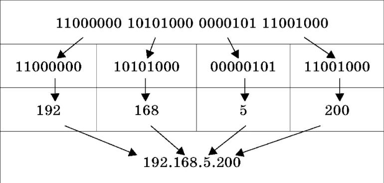

# IP-Addr-Counter

## Task
Задача выполняется в соответствии с описанием https://github.com/Ecwid/new-job/blob/master/IP-Addr-Counter.md .  
Необходимо посчитать количество уникальных адресов (не учитывая повторяющиеся) в переданном файле, затратив как можно меньше памяти и времени.  
Реализовано консольное приложение, которое на вход получает путь к файлу, а на выходе показывает количество уникальных айпишников.  

## Сборка и вызов jar файла
Используется JDK 11.  
Необходимо вызвать команду  
```
mnv install
```
Для запуска в аргументы передаём имя файла, например, ip_addresses
```
java -jar target/ip-addr-counter-1.0.0.jar -file ip_addresses
```

## Объяснение решения и реализация  
Так как каждое число (октет/подсеть) IPv4 находится в диапазоне от 0 до 255 
и состоит из 8 бит (полностью составляет 32-бита),
что совпадает с размерностью типа int. Но из-за того, что 
не получается получить unsigned значение и максимальное положительное int 
число 2147483647 и при переводе в битное можно выйти за этот предел, 
используем внутри класса BitSetIPStorage - negativeNumbers и positiveNumbers.  
**Какая хеш-функция используется?**  
  
В самом начале разделяем ip адресс на октеты через точку, получаем массив.  
Нулевой элемент массива нужно переместить на 24 бита влево, первый - на 16 бит влево,
второй - на 8 бит влево, и для последнего остаются оставшиеся 8.  
В итоге при переводе в десятичную систему числения, получаем какое-то уникальное число.  
Для первого октета (например, 130.143.96.165) вычисления будут выглядеть как-то так:
```
10000010 (2) = 130 (10)
10000010 00000000 00000000 00000000 (2) = 2 181 038 080 (10)
```
```java
Integer.toUnsignedString(byteIntOctet << 8 *( 3 - 0))
```
256 в 3 степени умножив на октет - это то же самое, что сместить влево << на 24 бита, т.к.  
256^3 (10) = 16 777 216 (10) = 00000001 00000000 00000000 00000000 (2)  
И потом к этому прибавляется следующее число на разряд меньшее.  
Преимуществом такого подхода является фиксированный размер памяти при увеличении количества адресов в выборке.

## Производительность  
| Result of unique IP count |               Time               |
|:-------------------------:|:--------------------------------:|
|            10             |            49 millis             |
|            100            |            53 millis             |
|           1 000           |            61 millis             |
|          10 000           |            94 millis             |
|          100 000          |            139 millis            |
|       1 000 000 000       | first starting was  = 30 minutes |

AMD Ryzen 5 5500, 16 GB, Windows 10  

На практике показало, что использование ```Math.pow(256, 3 - i)``` или ```<< 8 *( 3 - i)``` никак не повлияло на
ускорение производительности с учётом обработки 1 миллиарда уникальных IP

## almost
При использовании HashSet или данного примера
```java
fileStorage.getLines()
    .flatMapToInt(line -> IntStream.of(ipParser.parseToInt(line)))
    .distinct()
    .count();
```
производительность будет низкой и можно выйти за пределы памяти.
